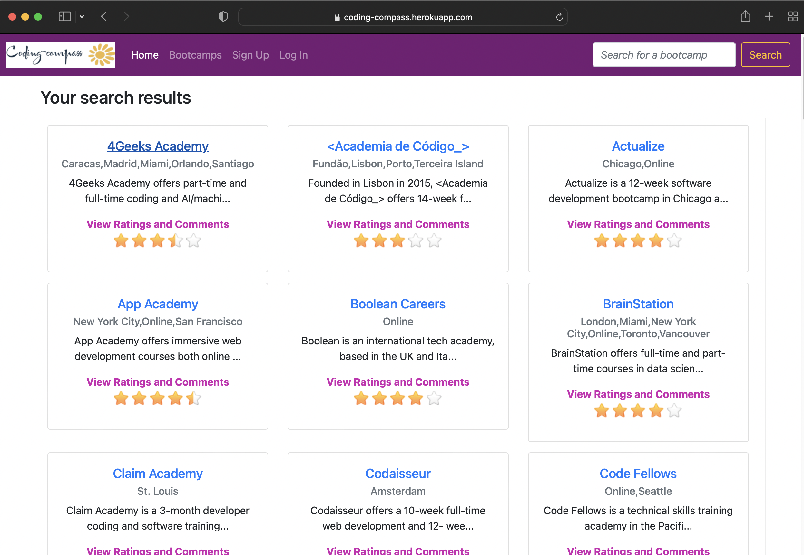

# Coding-Compass

### A group project created with:
- JS
- Handlebars
- Bootstrap
- MySQL
- Node.js
- Express.js
- Raty-js
- Jquery
- Heroku

# Table of Contents
  - [Description](#description)
  - [Usage](#usage)
  - [Installation](#installation)
  - [Features](#features)
  - [Contributors](#contributors)
  - [Future Development](#futuredevelopment)

## Description
This is a wesite that is designed to allow you to look up potential Coding bootcamps
to compare them with other ones to see which will be the best for you. 

## Usage
Follow the link to deploy and interact (https://coding-compass.herokuapp.com/)

## Installation
git clone https://github.com/hienm9/Coding-Compass

## Features

### Contributors
- Hien Mai
- Emily Kruse
- Motasem Diab
- Joseph Beike
- Mitchell George
- Malak Markus 
- Richard Coady
- Michael Welsh?

## Future Development
- Add more camps and courses to Coding-Compass
- Add more sections for coments and courses

##### (*Development started in May, 2022*)

